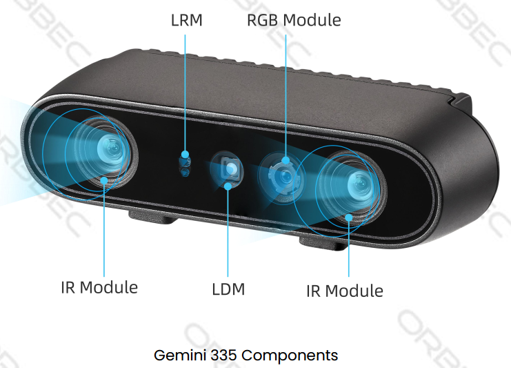

## Coordinate Systems and TF Transforms

### Camera sensor structure




### ROS Robot Coordinate System vs Camera Optical Coordinate System

* Observation perspective:
  * Imagine we stand behind the camera looking forward.
  * Always use this perspective when discussing coordinates, left/right IR, sensor positions, etc.


* ROS coordinate system: (X: forward, Y: left, Z: up)
* Camera optical coordinate system: (X: right, Y: down, Z: forward)
* All data published by the wrapper topics are directly from the camera sensors in the optical coordinate system.
* Static and dynamic TF topics publish both the optical and ROS coordinate systems, giving users the ability to transform between them.

### Using ROS1 TF Tools

#### View TF Tree Structure

You can use the following ROS1 commands to print and visualize the TF tree published by the camera package:

**Print all TF relationships:**

```bash
rosrun tf view_frames
```

This command generates a `frames.pdf` file that shows the hierarchical relationships between all frames.


**View all currently published TF information:**

```bash
rostopic echo /tf
```

**View the TF transform between two specified frames:**

Use the following command to view the transform between two specific frames:

```bash
rosrun tf tf_echo [source_frame] [target_frame]
```

For example, to view the transform from `camera_link` to `camera_depth_optical_frame`:

```bash
rosrun tf tf_echo camera_link camera_depth_optical_frame
```

This command continuously outputs the real-time transform information between the two frames, including:

- Translation: x, y, z
- Rotation: Quaternion (x, y, z, w) and Euler angles (roll, pitch, yaw)

Sample output:

```
At time 1761645099.762
- Translation: [0.000, 0.000, 0.000]
- Rotation: in Quaternion [-0.500, 0.500, -0.500, 0.500]
            in RPY (radian) [-1.571, -0.000, -1.571]
            in RPY (degree) [-90.000, -0.000, -90.000]
```

#### Visualize the TF Tree in rviz

You can visualize the TF tree structure and relative frame positions in real time in rviz:

```bash
rviz
```

In rviz:

- Add the `TF` display plugin
- Set the Fixed Frame to `camera_link` or `camera_depth_optical_frame`, etc.
- Select the TF frames to display


### ROS1 Camera TF Calculation and Publication Mechanism

#### Core Function: `OBCameraNode::calcAndPublishStaticTransform()`

The camera node uses this function to compute and publish all static transforms between sensors.

```cpp
void OBCameraNode::calcAndPublishStaticTransform() {
  tf2::Quaternion quaternion_optical, zero_rot;
  zero_rot.setRPY(0.0, 0.0, 0.0);
  quaternion_optical.setRPY(-M_PI / 2, 0.0, -M_PI / 2);
  tf2::Vector3 zero_trans(0, 0, 0);
  if (!stream_profile_.count(base_stream_)) {
    ROS_ERROR_STREAM("Base stream is not available");
    return;
  }
  auto base_stream_profile = stream_profile_[base_stream_];
  CHECK_NOTNULL(base_stream_profile.get());
  for (const auto& item : stream_profile_) {
    auto stream_index = item.first;
    auto stream_profile = item.second;
    if (!stream_profile) {
      continue;
    }
    OBExtrinsic ex;
    try {
      ex = stream_profile->getExtrinsicTo(base_stream_profile);
    } catch (const ob::Error& e) {
      ROS_ERROR_STREAM("Failed to get " << stream_name_[stream_index]
                                        << " extrinsic: " << e.getMessage());
      ex = OBExtrinsic({{1, 0, 0, 0, 1, 0, 0, 0, 1}, {0, 0, 0}});
    }

    auto Q = rotationMatrixToQuaternion(ex.rot);
    Q = quaternion_optical * Q * quaternion_optical.inverse();
    Q = Q.normalize();
    tf2::Vector3 trans(ex.trans[0], ex.trans[1], ex.trans[2]);

    auto timestamp = ros::Time::now();
    if (stream_index.first != base_stream_.first) {
      if (stream_index.first == OB_STREAM_IR_RIGHT && base_stream_.first == OB_STREAM_DEPTH) {
        trans[0] = std::abs(trans[0]);  // because left and right ir calibration is error
      }
      publishStaticTF(timestamp, trans, Q, frame_id_[base_stream_], frame_id_[stream_index]);
    }
    publishStaticTF(timestamp, zero_trans, quaternion_optical, frame_id_[stream_index],
                    optical_frame_id_[stream_index]);
    ROS_INFO_STREAM("Publishing static transform from " << stream_name_[stream_index] << " to "
                                                        << stream_name_[base_stream_]);
    ROS_INFO_STREAM("Translation " << trans[0] << ", " << trans[1] << ", " << trans[2]);
    ROS_INFO_STREAM("Rotation " << Q.getX() << ", " << Q.getY() << ", " << Q.getZ() << ", "
                                << Q.getW());
  }
  auto device_info = device_->getDeviceInfo();
  CHECK_NOTNULL(device_info);
  auto pid = device_info->pid();
  if ((pid == FEMTO_BOLT_PID || pid == FEMTO_MEGA_PID) && enable_stream_[DEPTH] &&
      enable_stream_[COLOR]) {
    // calc depth to color
    CHECK_NOTNULL(stream_profile_[COLOR]);
    auto depth_to_color_extrinsics = base_stream_profile->getExtrinsicTo(stream_profile_[COLOR]);
    auto Q = rotationMatrixToQuaternion(depth_to_color_extrinsics.rot);
    Q = quaternion_optical * Q * quaternion_optical.inverse();
    Q = Q.normalize();
    publishStaticTF(ros::Time::now(), zero_trans, Q, camera_link_frame_id_,
                    frame_id_[base_stream_]);
  } else {
    publishStaticTF(ros::Time::now(), zero_trans, zero_rot, camera_link_frame_id_,
                    frame_id_[base_stream_]);
  }
}
```

#### Function Explanation

Below is a detailed explanation of the ROS1 code:

**Quaternion Initialization and Coordinate System Transformation**

```cpp
tf2::Quaternion quaternion_optical, zero_rot;
zero_rot.setRPY(0.0, 0.0, 0.0);
quaternion_optical.setRPY(-M_PI / 2, 0.0, -M_PI / 2);
tf2::Vector3 zero_trans(0, 0, 0);
```

- `quaternion_optical`: Defines the rotation transforming the camera optical coordinate system to the ROS standard coordinate system (90-degree rotations). This rotates from camera optical (X right, Y down, Z forward) to ROS standard (X forward, Y left, Z up).
- `zero_trans`: Used for publishing transforms that only include rotation.

**Base Stream**

```cpp
auto base_stream_profile = stream_profile_[base_stream_];
CHECK_NOTNULL(base_stream_profile.get());
```

- Select a base stream (usually depth). All other sensor transforms are computed relative to this base stream.

**Iterate Over All Streams and Compute Relative Transforms**

```cpp
for (const auto& item : stream_profile_) {
    auto stream_index = item.first;
    auto stream_profile = item.second;
    if (!stream_profile) {
        continue;
    }
    OBExtrinsic ex;
    try {
        ex = stream_profile->getExtrinsicTo(base_stream_profile);
    } catch (const ob::Error& e) {
        ROS_ERROR_STREAM("Failed to get " << stream_name_[stream_index]
                                          << " extrinsic: " << e.getMessage());
        ex = OBExtrinsic({{1, 0, 0, 0, 1, 0, 0, 0, 1}, {0, 0, 0}});
    }

    auto Q = rotationMatrixToQuaternion(ex.rot);
    Q = quaternion_optical * Q * quaternion_optical.inverse();
    Q = Q.normalize();
    tf2::Vector3 trans(ex.trans[0], ex.trans[1], ex.trans[2]);

    auto timestamp = ros::Time::now();
```

- This transform converts the camera's native optical coordinate system into the ROS standard coordinate system.

**Publish TF Transforms**

```cpp
if (stream_index.first != base_stream_.first) {
    if (stream_index.first == OB_STREAM_IR_RIGHT && base_stream_.first == OB_STREAM_DEPTH) {
        trans[0] = std::abs(trans[0]);  // because left and right ir calibration is error
    }
    publishStaticTF(timestamp, trans, Q, frame_id_[base_stream_], frame_id_[stream_index]);
}
publishStaticTF(timestamp, zero_trans, quaternion_optical, frame_id_[stream_index],
                optical_frame_id_[stream_index]);
ROS_INFO_STREAM("Publishing static transform from " << stream_name_[stream_index] << " to "
                                                    << stream_name_[base_stream_]);
ROS_INFO_STREAM("Translation " << trans[0] << ", " << trans[1] << ", " << trans[2]);
ROS_INFO_STREAM("Rotation " << Q.getX() << ", " << Q.getY() << ", " << Q.getZ() << ", "
                            << Q.getW());
```

- First `publishStaticTF`: Published only when the current stream is not the base stream. Contains translation + rotation from base stream to current sensor.
- Second `publishStaticTF`: Publishes the transform from the physical frame to the optical frame (pure rotation, no translation).
- `frame_id_[stream_index]`: Physical frame name (e.g., `camera_depth_frame`).
- `optical_frame_id_[stream_index]`: Optical frame name (e.g., `camera_depth_optical_frame`).
- Special handling for left/right IR camera X-axis offset using `abs()` to ensure positive value.

**Special Device Handling (FEMTO Series)**

```cpp
auto device_info = device_->getDeviceInfo();
CHECK_NOTNULL(device_info);
auto pid = device_info->pid();
if ((pid == FEMTO_BOLT_PID || pid == FEMTO_MEGA_PID) && enable_stream_[DEPTH] &&
    enable_stream_[COLOR]) {
    // calc depth to color
    CHECK_NOTNULL(stream_profile_[COLOR]);
    auto depth_to_color_extrinsics = base_stream_profile->getExtrinsicTo(stream_profile_[COLOR]);
    auto Q = rotationMatrixToQuaternion(depth_to_color_extrinsics.rot);
    Q = quaternion_optical * Q * quaternion_optical.inverse();
    Q = Q.normalize();
    publishStaticTF(ros::Time::now(), zero_trans, Q, camera_link_frame_id_,
                    frame_id_[base_stream_]);
} else {
    publishStaticTF(ros::Time::now(), zero_trans, zero_rot, camera_link_frame_id_,
                    frame_id_[base_stream_]);
}
```

- Identify FEMTO series cameras by PID (FEMTO_BOLT, FEMTO_MEGA).
- For FEMTO series, additionally compute the transform from depth to color sensor to ensure proper mapping across models.


