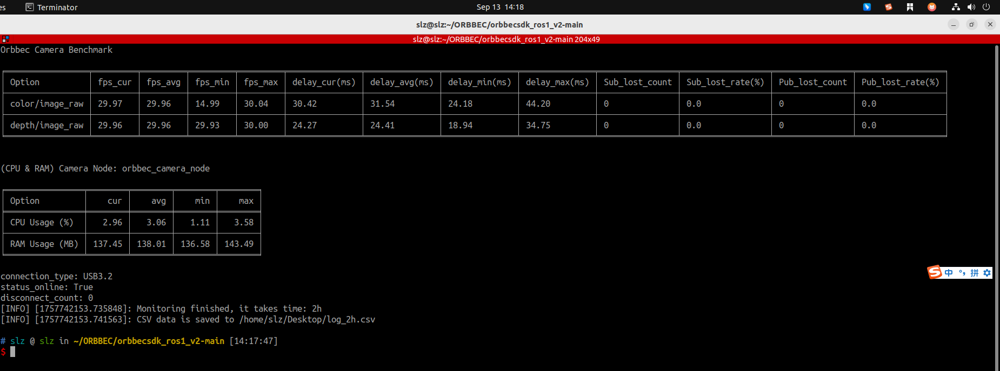
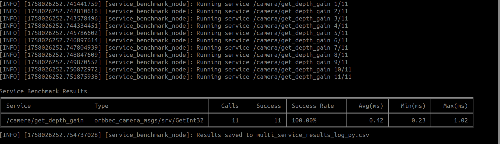

# Performance Benchmark Tools

This section introduces the performance benchmark tools, their purpose, and the metrics they help measure.

## common_benchmark_node.py

`common_benchmark_node.py` monitors Orbbec camera performance in a ROS environment. It collects and records key camera metrics such as frame rate, latency, system resource usage, and packet loss rate to help evaluate camera node stability and performance. Statistics are updated once per second.

Features:

- Measures published image frame rate and latency (current, minimum, maximum, and average).
- Monitors camera node CPU/ARM usage (current, minimum, maximum, and average).
- Tracks frame drop rate (publisher) and packet loss rate (subscriber).
- Prints real-time statistics at 1 Hz and saves results to a CSV file.
- Supports configurable runtime, CSV output path, and camera names.

In ROS1, both frame drop rate and packet loss rate can be measured because the message header contains the `seq` field.



Run with default settings:

```bash
rosrun orbbec_camera common_benchmark_node.py --run_time 30s
```

Run with a custom CSV output path:

```bash
rosrun orbbec_camera common_benchmark_node.py \
  --run_time 2h \
  --csv_file /path/to/log.csv
```

Multi-camera monitoring example:

```bash
rosrun orbbec_camera common_benchmark_node.py \
  --run_time 1h \
  --csv_file /tmp/cam_log.csv \
  --camera_names camera,camera01
```

Parameters:

- `--run_time` / `_run_time`: Monitoring duration. Supported formats include `10s`, `5m`, `1h`, and `2d`. The default is `10s`.
- `--csv_file` / `_csv_file`: Output CSV file path.
- `--camera_names` / `_camera_names`: Camera name list, separated by commas.

## service_benchmark_node.py

`service_benchmark_node.py` monitors service call performance. It calls multiple services from a YAML configuration file and reports call count, success rate, average time, minimum time, and maximum time.

Features:

- Benchmarks multiple services defined in a YAML configuration file.
- Builds requests automatically from the active ROS service type.
- Can save benchmark results to a CSV file.



Multiple services benchmark (YAML configuration + CSV output):

```bash
rosrun orbbec_camera service_benchmark_node.py \
  --yaml_file /path/to/default_service.yaml \
  --csv_file /path/to/results.csv
```

The example YAML configuration is available at `scripts/default_service.yaml`. `default_count` is used when an entry does not specify its own call count.

## service_benchmark_node

`service_benchmark_node` is the C++ service call benchmark tool. The Python version, `service_benchmark_node.py`, is recommended for most cases because it can batch-test services from YAML and write CSV output.

Single service benchmark:

```bash
rosrun orbbec_camera service_benchmark_node \
  _service_name:=/camera/set_color_ae_roi \
  _service_type:=orbbec_camera/SetArrays \
  _request_data:='{data_param: [0, 1279, 0, 719]}'
```

Multiple services benchmark (YAML configuration):

```bash
rosrun orbbec_camera service_benchmark_node \
  _yaml_file:=/path/to/default_service.yaml
```

## Benchmark Recommendations

1. Start with a small service set to verify network and device stability, then expand to the full service list.
2. For long runs, write `--csv_file` to a persistent directory.
3. Archive results by device and date for trend analysis.
4. If abnormal latency appears, inspect the `/camera/device_status` topic together with the benchmark result.

For a complete service YAML example, see `scripts/default_service.yaml` in the source tree.
