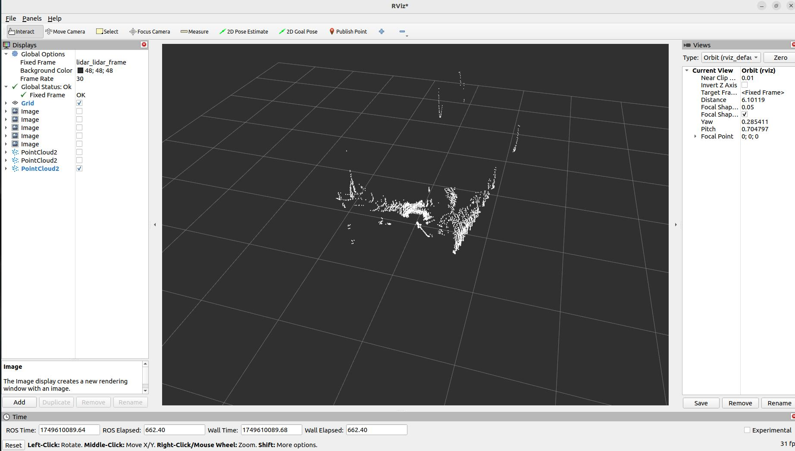

This ROS1 driver supports your use of Orbbec single-line/multi-line LiDAR. This document provides installation instructions, usage guides, and other important information to help you quickly get started using this driver.

## 1. Installation

### 1.1 Prerequisites

Before using the OrbbecSDK ROS1 LiDAR driver, please ensure that the following dependencies are installed on your system:

- **ROS1**: A valid installation of ROS1 (Melodic, Noetic, or other supported distributions).
  - If you need help, please refer to the [ROS1 Installation Guide](http://wiki.ros.org/ROS/Installation).

### 1.2 Install Dependencies

```bash
# Assume you have sourced ROS environment
sudo apt install libgflags-dev nlohmann-json3-dev
```

### 1.3 Install udev Rules

```bash
cd ~/catkin_ws/src/orbbec-ros-sdk/scripts
sudo bash install_udev_rules.sh
sudo udevadm control --reload-rules && sudo udevadm trigger
```

### 1.4 Build the Package

```bash
cd ~/catkin_ws/
# Build release version, default is Debug
catkin_make -DCMAKE_BUILD_TYPE=Release
```

### 1.5 Launch the LiDAR Node

* First terminal

```bash
source devel/setup.bash
roslaunch orbbec_camera lidar.launch
```

* Second terminal

```bash
source devel/setup.bash
rviz
```

1. Open RViz.
2. Add a `PointCloud2` or `LaserScan` display.
3. For `PointCloud2`, select the `/lidar/cloud/points` topic; for `LaserScan`, select the `/lidar/scan/points` topic.
4. Set the `Fixed Frame` to `lidar_lidar_frame` to properly align the data.

* `PointCloud2` visualization example:



* `LaserScan` visualization example:


## 2. Usage

### 2.1 Running the Driver

To start the driver, launch the provided ROS1 launch file:

```bash
source devel/setup.bash
# Launch the driver with point cloud data
roslaunch orbbec_camera lidar.launch lidar_format:=LIDAR_POINT
# Launch the driver with sphere point cloud data
roslaunch orbbec_camera lidar.launch lidar_format:=LIDAR_SPHERE_POINT
# Launch the driver with laser scan data
roslaunch orbbec_camera lidar.launch lidar_format:=LIDAR_SCAN
# Launch the driver with IMU enabled
roslaunch orbbec_camera lidar.launch enable_imu:=true imu_rate:=50hz
# Launch the driver with both point cloud and IMU data
roslaunch orbbec_camera lidar.launch lidar_format:=LIDAR_POINT enable_imu:=true imu_rate:=100hz
```

This command will start the node that interfaces with the Orbbec LiDAR device. Please ensure that the LiDAR hardware is properly connected before running this command.

### 2.2 Get Device Information for Connected LiDARs

```bash
rosrun orbbec_camera list_devices_node
```

This command will list the connected LiDAR devices and display their respective IP addresses and ports. You can use this information to configure the driver to connect to specific devices.

### 2.3 Check Which Configurations the LiDAR Supports

```bash
rosrun orbbec_camera list_camera_profile_mode_node
```

### 2.4 Parameters and Configuration

The `lidar.launch` file contains default parameters for the driver. You can customize these settings by modifying the launch file or creating a custom configuration file. Key parameters include:

- **device_type**: Type of device to launch. Options: `lidar`, `camera`. Set to `lidar` to launch LiDAR device, set to `camera` to launch camera device.
- **camera_name**: Launch node namespace.
- **device_num**: Number of devices. Must be filled if you need to launch multiple devices.
- **upgrade_firmware**: Firmware upgrade function. Input parameter is firmware path.
- **connection_delay**: Delay time for reopening device (in milliseconds). Immediately reopening device during hot-plug may cause firmware crash.
- **publish_tf**: Enable TF publishing.
- **tf_publish_rate**: TF publishing frequency.
- **lidar_format**: LiDAR data format. Options: `LIDAR_POINT`, `LIDAR_SPHERE_POINT`, `LIDAR_SCAN`
- **lidar_rate**: LiDAR scanning rate.
- **publish_n_pkts**: Number of frames to accumulate before publishing merged data. Range: 1-12000. Only effective when lidar format is `LIDAR_POINT` or `LIDAR_SPHERE_POINT`, used to accumulate specified number of frames before publishing merged point cloud data. Default: `1`
- **enable_scan_to_point**: Convert scan data to point cloud data, publish PointCloud2 data type topic.
- **repetitive_scan_mode**: Repetitive scan mode parameter.
- **filter_level**: Filter level parameter.
- **vertical_fov**: Vertical angle parameter.
- **min_angle**: Minimum angle of LiDAR scanning range in degrees (e.g., `-135.0`). Default: `-135.0`.
- **max_angle**: Maximum angle of LiDAR scanning range in degrees (e.g., `135.0`). Default: `135.0`.
- **min_range**: Minimum measurable distance of LiDAR in meters. Default: `0.05`.
- **max_range**: Maximum measurable distance of LiDAR in meters. Default: `30.0`.
- **echo_mode**: LiDAR echo mode. Options: `Last Echo`, `First Echo`
- **enumerate_net_device**: Enable automatic enumeration of network devices.
- **net_device_ip**: IP address of network device.
- **net_device_port**: Port number of network device.
- **log_level**: SDK log level, default is `none`, options are `debug`, `info`, `warn`, `error`, `fatal`
- **time_domain**: Device timestamp type. Options: `device`, `global`, `system`
- **enable_heartbeat**: Enable heartbeat function, default is `false`. If set to `true`, camera node will send heartbeat signal to firmware; should also be set to `true` if hardware logging is needed.
- **enable_imu**: Enable IMU (accelerometer + gyroscope) and output unified IMU topic data.
- **imu_rate**: Unified frequency of IMU (accelerometer and gyroscope).
- **accel_range**: Range of accelerometer.
- **gyro_range**: Range of gyroscope.
- **linear_accel_cov**: Linear acceleration covariance value, default is `0.0001`.
- **angular_vel_cov**: Angular velocity covariance value, default is `0.0001`.

## 3. Point Cloud Data Details

### 3.1 Point Cloud Format

PointCloud2 (PointXYZITO) point cloud format is as follows:

```
float32 x               # X axis, unit: meters
float32 y               # Y axis, unit: meters
float32 z               # Z axis, unit: meters
uint8   intensity       # LiDAR intensity
uint8   tag             # LiDAR tag
uint32  offset_time     # Point cloud offset relative to topic time, unit nanoseconds
```

### 3.2 Point Cloud Aggregation Functionality

The `publish_n_pkts` parameter enables point cloud aggregation functionality, which allows the LiDAR to accumulate a specified number of frames before publishing, then merge these frames into a larger point cloud data package for publishing.

#### Features:

- **Parameter Range**: 1-12000 frames
- **Applicable Formats**: Only effective when lidar format is `LIDAR_POINT` or `LIDAR_SPHERE_POINT`
- **Default Value**: 1 (no aggregation, each frame published individually)
- **Purpose**: Improve point cloud density, suitable for applications requiring denser point cloud data

#### Usage Examples:

```bash
# Aggregate 10 frames before publishing
roslaunch orbbec_camera lidar.launch lidar_format:=LIDAR_POINT publish_n_pkts:=10

# Aggregate 100 frames before publishing
roslaunch orbbec_camera lidar.launch lidar_format:=LIDAR_SPHERE_POINT publish_n_pkts:=100
```

**Note**: Increasing the `publish_n_pkts` value will improve point cloud density but will also increase latency and memory usage. Please adjust according to actual application requirements.

## 4. IMU Data

### 4.1 IMU Topics

When IMU is enabled, the following topics will be published:

- **`/lidar/imu/sample`**: Unified IMU topic containing synchronized accelerometer and gyroscope data in `sensor_msgs/Imu` format.
- **`/lidar/lidar_to_imu`**: Transform relationship from LiDAR coordinate system to IMU coordinate system.

### 4.2 Using IMU Data

To enable IMU data collection:

```bash
# Launch with IMU enabled
roslaunch orbbec_camera lidar.launch enable_imu:=true imu_rate:=50hz

# Check IMU topics
rostopic list | grep imu

# View IMU data
rostopic echo /lidar/imu/sample
```

IMU data includes:

- **linear_acceleration**: 3D acceleration data (x, y, z), unit: m/s²
- **angular_velocity**: 3D angular velocity data (x, y, z), unit: rad/s
- **orientation**: Quaternion orientation (not provided by hardware, set to zero)
