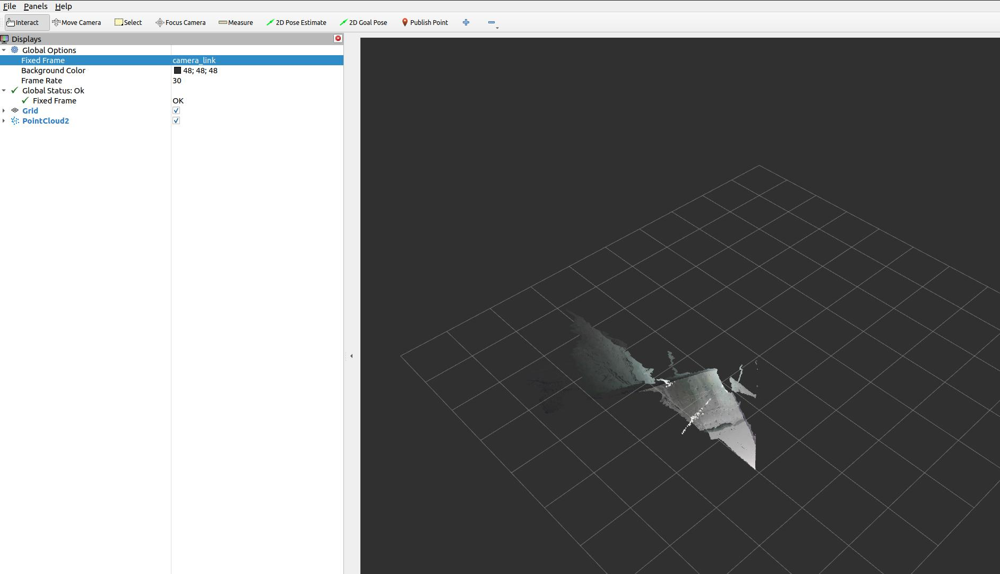

## nabling and Visualizing Point Cloud in ROS 1

This section demonstrates how to enable point cloud data output from the camera node and visualize it using RViz.

### Enabling Depth Point Cloud

#### Command to Enable Depth Point Cloud

To activate the point cloud data stream for depth information, use the following command:

```bash
roslaunch orbbec_camera gemini_330_series.launch enable_point_cloud:=true
```

#### Visualizing Depth Point Cloud in RViz

After running the above command, perform the following steps to visualize the depth point cloud:

1. Open RViz.
2. Add a `PointCloud2` display.
3. Select the `/camera/depth/points` topic for visualization.
4. Set the fixed frame to `camera_link` to properly align the data.

##### Example Visualization

Here is what the depth point cloud might look like in RViz:


### Enabling Colored Point Cloud

#### Command to Enable Colored Point Cloud

To enable the colored point cloud feature, enter the following command:

```bash
ros2 launch orbbec_camera gemini_330_series.launch.py enable_colored_point_cloud:=true
```

#### Visualizing Colored Point Cloud in RViz

To visualize the colored point cloud data:

1. Launch RViz following the command execution.
2. Add a `PointCloud2` display panel.
3. Choose the `/camera/depth_registered/points` topic from the list.
4. Ensure the fixed frame is set to `camera_link`.

##### Example Visualization

The result of the colored point cloud in RViz should look similar to this:


