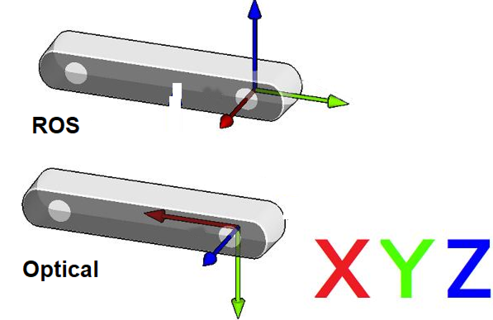

## 坐标系和 TF 变换

### 相机传感器结构


### ROS机器人坐标系 vs 相机光学坐标系

* 观察视角：
  * 想象我们站在相机后面，向前看。
  * 在谈论坐标、左右红外、传感器位置等时，始终使用这个观察视角。



* ROS坐标系：(X: 前进方向, Y: 左侧, Z: 向上)
* 相机光学坐标系：(X: 右侧, Y: 向下, Z: 前进方向)
* 我们包装器话题中发布的所有数据都是直接从相机传感器获取的光学数据。
* 静态和动态TF话题发布光学坐标系和ROS坐标系，为用户提供从一个坐标系转换到另一个坐标系的能力。

### ROS1 TF工具的使用

#### 查看TF树结构

可以使用以下ROS1命令来打印和可视化相机包发布的TF树：

**打印所有TF关系：**

```bash
rosrun tf view_frames
```

这个命令会生成一个 `frames.pdf`文件，展示所有frame之间的层级关系。


**查看所有正在发布的TF信息：**

```bash
rostopic echo /tf
```

**查看指定两个frame之间的TF变换关系：**

使用以下命令可以查看两个特定frame之间的变换关系：

```bash
rosrun tf tf_echo [source_frame] [target_frame]
```

例如，查看从 `camera_link` 到 `camera_depth_optical_frame` 的变换：

```bash
rosrun tf tf_echo camera_link camera_depth_optical_frame
```

此命令会持续输出两个frame之间的实时变换信息，包括：

- 平移信息（Translation）：x, y, z坐标
- 旋转信息（Rotation）：四元数(x, y, z, w)和欧拉角(roll, pitch, yaw)

示例输出：

```
At time 1761645099.762
- Translation: [0.000, 0.000, 0.000]
- Rotation: in Quaternion [-0.500, 0.500, -0.500, 0.500]
            in RPY (radian) [-1.571, -0.000, -1.571]
            in RPY (degree) [-90.000, -0.000, -90.000]

```

#### 使用rviz可视化TF树

在rviz中可以实时可视化TF树结构和坐标系的相对位置：

```bash
rviz
```

在rviz中：

- 添加 `TF`显示插件
- 配置固定框架（Fixed Frame）为 `camera_link`或 `camera_depth_optical_frame`等等
- 选择显示的TF框架树


### ROS1相机TF计算和发布机制

#### 核心函数：`OBCameraNode::calcAndPublishStaticTransform()`

相机节点通过此函数计算和发布所有传感器之间的静态转换关系。

```cpp
void OBCameraNode::calcAndPublishStaticTransform() {
  tf2::Quaternion quaternion_optical, zero_rot;
  zero_rot.setRPY(0.0, 0.0, 0.0);
  quaternion_optical.setRPY(-M_PI / 2, 0.0, -M_PI / 2);
  tf2::Vector3 zero_trans(0, 0, 0);
  if (!stream_profile_.count(base_stream_)) {
    ROS_ERROR_STREAM("Base stream is not available");
    return;
  }
  auto base_stream_profile = stream_profile_[base_stream_];
  CHECK_NOTNULL(base_stream_profile.get());
  for (const auto& item : stream_profile_) {
    auto stream_index = item.first;
    auto stream_profile = item.second;
    if (!stream_profile) {
      continue;
    }
    OBExtrinsic ex;
    try {
      ex = stream_profile->getExtrinsicTo(base_stream_profile);
    } catch (const ob::Error& e) {
      ROS_ERROR_STREAM("Failed to get " << stream_name_[stream_index]
                                        << " extrinsic: " << e.getMessage());
      ex = OBExtrinsic({{1, 0, 0, 0, 1, 0, 0, 0, 1}, {0, 0, 0}});
    }

    auto Q = rotationMatrixToQuaternion(ex.rot);
    Q = quaternion_optical * Q * quaternion_optical.inverse();
    Q = Q.normalize();
    tf2::Vector3 trans(ex.trans[0], ex.trans[1], ex.trans[2]);

    auto timestamp = ros::Time::now();
    if (stream_index.first != base_stream_.first) {
      if (stream_index.first == OB_STREAM_IR_RIGHT && base_stream_.first == OB_STREAM_DEPTH) {
        trans[0] = std::abs(trans[0]);  // because left and right ir calibration is error
      }
      publishStaticTF(timestamp, trans, Q, frame_id_[base_stream_], frame_id_[stream_index]);
    }
    publishStaticTF(timestamp, zero_trans, quaternion_optical, frame_id_[stream_index],
                    optical_frame_id_[stream_index]);
    ROS_INFO_STREAM("Publishing static transform from " << stream_name_[stream_index] << " to "
                                                        << stream_name_[base_stream_]);
    ROS_INFO_STREAM("Translation " << trans[0] << ", " << trans[1] << ", " << trans[2]);
    ROS_INFO_STREAM("Rotation " << Q.getX() << ", " << Q.getY() << ", " << Q.getZ() << ", "
                                << Q.getW());
  }
  auto device_info = device_->getDeviceInfo();
  CHECK_NOTNULL(device_info);
  auto pid = device_info->pid();
  if ((pid == FEMTO_BOLT_PID || pid == FEMTO_MEGA_PID) && enable_stream_[DEPTH] &&
      enable_stream_[COLOR]) {
    // calc depth to color
    CHECK_NOTNULL(stream_profile_[COLOR]);
    auto depth_to_color_extrinsics = base_stream_profile->getExtrinsicTo(stream_profile_[COLOR]);
    auto Q = rotationMatrixToQuaternion(depth_to_color_extrinsics.rot);
    Q = quaternion_optical * Q * quaternion_optical.inverse();
    Q = Q.normalize();
    publishStaticTF(ros::Time::now(), zero_trans, Q, camera_link_frame_id_,
                    frame_id_[base_stream_]);
  } else {
    publishStaticTF(ros::Time::now(), zero_trans, zero_rot, camera_link_frame_id_,
                    frame_id_[base_stream_]);
  }
}
```

#### 函数解析

下面是ROS1代码的详细解释：

**四元数初始化与坐标系变换**

```cpp
tf2::Quaternion quaternion_optical, zero_rot;
zero_rot.setRPY(0.0, 0.0, 0.0);
quaternion_optical.setRPY(-M_PI / 2, 0.0, -M_PI / 2);
tf2::Vector3 zero_trans(0, 0, 0);
```

- `quaternion_optical`：定义光学坐标系到ROS标准坐标系的旋转变换（90度旋转），这个旋转将相机光学坐标系（X右、Y下、Z前）转换为ROS标准坐标系（X前、Y左、Z上）
- `zero_trans`：用于发布仅包含旋转而无平移的变换

**基准流**

```cpp
auto base_stream_profile = stream_profile_[base_stream_];
CHECK_NOTNULL(base_stream_profile.get());
```

- 选择一个基准流（通常是深度流），所有其他传感器的变换都相对于这个基准流进行计算

**遍历所有流并计算相对变换**

```cpp
for (const auto& item : stream_profile_) {
    auto stream_index = item.first;
    auto stream_profile = item.second;
    if (!stream_profile) {
        continue;
    }
    OBExtrinsic ex;
    try {
        ex = stream_profile->getExtrinsicTo(base_stream_profile);
    } catch (const ob::Error& e) {
        ROS_ERROR_STREAM("Failed to get " << stream_name_[stream_index]
                                          << " extrinsic: " << e.getMessage());
        ex = OBExtrinsic({{1, 0, 0, 0, 1, 0, 0, 0, 1}, {0, 0, 0}});
    }

    auto Q = rotationMatrixToQuaternion(ex.rot);
    Q = quaternion_optical * Q * quaternion_optical.inverse();
    Q = Q.normalize();
    tf2::Vector3 trans(ex.trans[0], ex.trans[1], ex.trans[2]);

    auto timestamp = ros::Time::now();
```

- 这个变换将相机原生的光学坐标系转换为ROS标准坐标系

**发布TF变换**

```cpp
if (stream_index.first != base_stream_.first) {
    if (stream_index.first == OB_STREAM_IR_RIGHT && base_stream_.first == OB_STREAM_DEPTH) {
        trans[0] = std::abs(trans[0]);  // because left and right ir calibration is error
    }
    publishStaticTF(timestamp, trans, Q, frame_id_[base_stream_], frame_id_[stream_index]);
}
publishStaticTF(timestamp, zero_trans, quaternion_optical, frame_id_[stream_index],
                optical_frame_id_[stream_index]);
ROS_INFO_STREAM("Publishing static transform from " << stream_name_[stream_index] << " to "
                                                    << stream_name_[base_stream_]);
ROS_INFO_STREAM("Translation " << trans[0] << ", " << trans[1] << ", " << trans[2]);
ROS_INFO_STREAM("Rotation " << Q.getX() << ", " << Q.getY() << ", " << Q.getZ() << ", "
                            << Q.getW());
```

- 第一个 `publishStaticTF`：仅在当前流不是基准流时发布，包含从基准流到当前传感器的变换（平移+旋转）
- 第二个 `publishStaticTF`：发布从物理frame到光学frame的变换（纯旋转，无平移）
- `frame_id_[stream_index]`：物理坐标系frame名称（如 `camera_depth_frame`）
- `optical_frame_id_[stream_index]`：光学坐标系frame名称（如 `camera_depth_optical_frame`）
- 特殊处理左右红外摄像头的X轴偏移，通过 `abs()`确保其为正值

**特殊设备处理（FEMTO系列）**

```cpp
auto device_info = device_->getDeviceInfo();
CHECK_NOTNULL(device_info);
auto pid = device_info->pid();
if ((pid == FEMTO_BOLT_PID || pid == FEMTO_MEGA_PID) && enable_stream_[DEPTH] &&
    enable_stream_[COLOR]) {
    // calc depth to color
    CHECK_NOTNULL(stream_profile_[COLOR]);
    auto depth_to_color_extrinsics = base_stream_profile->getExtrinsicTo(stream_profile_[COLOR]);
    auto Q = rotationMatrixToQuaternion(depth_to_color_extrinsics.rot);
    Q = quaternion_optical * Q * quaternion_optical.inverse();
    Q = Q.normalize();
    publishStaticTF(ros::Time::now(), zero_trans, Q, camera_link_frame_id_,
                    frame_id_[base_stream_]);
} else {
    publishStaticTF(ros::Time::now(), zero_trans, zero_rot, camera_link_frame_id_,
                    frame_id_[base_stream_]);
}
```

- 根据设备PID识别FEMTO系列相机（FEMTO_BOLT、FEMTO_MEGA）
- 对于FEMTO系列相机，需要额外计算深度到颜色传感器的变换关系，确保了不同相机型号的坐标系正确映射


