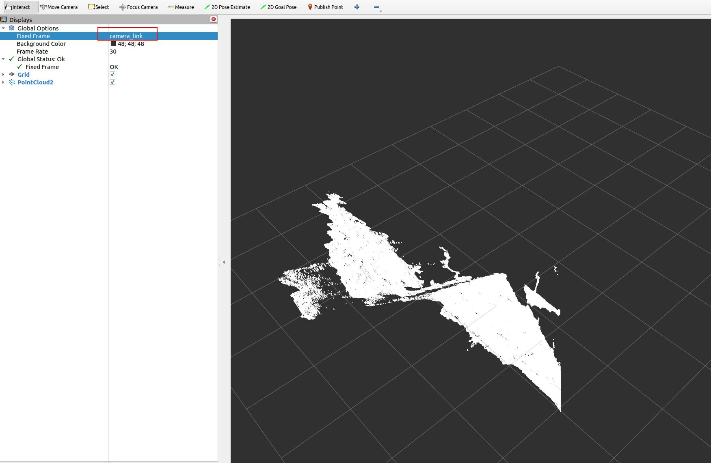

## 在ROS 1中启用和可视化点云

本节演示如何从相机节点启用点云数据输出并使用RViz进行可视化。

### 启用深度点云

#### 启用深度点云的命令

要激活深度信息的点云数据流，请使用以下命令：

```bash
roslaunch orbbec_camera gemini_330_series.launch enable_point_cloud:=true
```

#### 在RViz中可视化深度点云

运行上述命令后，执行以下步骤来可视化深度点云：

1. 打开RViz。
2. 添加一个`PointCloud2`显示器。
3. 选择`/camera/depth/points`话题进行可视化。
4. 将固定坐标系设置为`camera_link`以正确对齐数据。

**可视化示例**

以下是深度点云在RViz中的可能外观：



### 启用彩色点云

#### 启用彩色点云的命令

要启用彩色点云功能，请输入以下命令：

```bash
roslaunch orbbec_camera gemini_330_series.launch enable_colored_point_cloud:=true
```

#### 在RViz中可视化彩色点云

要可视化彩色点云数据：

1. 执行命令后启动RViz。
2. 添加一个`PointCloud2`显示面板。
3. 从列表中选择`/camera/depth_registered/points`话题。
4. 确保固定坐标系设置为`camera_link`。

**可视化示例**

在RViz中彩色点云的结果应该类似于这样：


