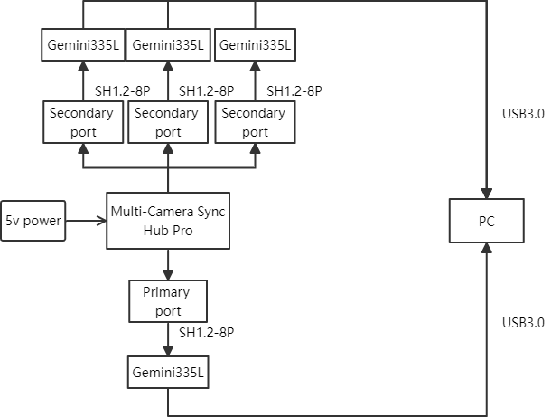

# 多相机同步说明

> 本文档的目的是说明如何在OrbbecSDK_ROS1中使用多相机同步

### 设置说明

* 请阅读多相机同步设置指南：[多相机同步设置](https://www.orbbec.com/docs/set-up-cameras-for-external-synchronization_v1-2/)
* 确保相机正确连接到多相机同步器。



### 使用OrbbecSDK_ROS1检查相机端口

```bash
rosrun orbbec_camera list_devices_node
```

### OrbbecSDK_ROS1多相机同步配置

打开multi_camera_synced.launch.py，并如下所示配置相机设置：

```xml
<launch>
    <arg name="camera_name" default="ob_camera"/>
    <arg name="3d_sensor" default="gemini_330_series"/>
    <arg name="camera1_prefix" default="01"/>
    <arg name="camera2_prefix" default="02"/>
    <arg name="camera1_usb_port" default="2-1.2.1"/>
    <arg name="camera2_usb_port" default="2-1.1"/>

    <arg name="device_num" default="2"/>
    <include file="$(find orbbec_camera)/launch/$(arg 3d_sensor).launch">
        <arg name="camera_name" value="$(arg camera_name)_$(arg camera1_prefix)"/>
        <arg name="usb_port" value="$(arg camera1_usb_port)"/>
        <arg name="device_num" value="$(arg device_num)"/>
        <arg name="sync_mode" default="software_triggering"/>
    </include>

    <include file="$(find orbbec_camera)/launch/$(arg 3d_sensor).launch">
        <arg name="camera_name" value="$(arg camera_name)_$(arg camera2_prefix)"/>
        <arg name="usb_port" value="$(arg camera2_usb_port)"/>
        <arg name="device_num" value="$(arg device_num)"/>
        <arg name="sync_mode" default="hardware_triggering"/>
    </include>
</launch>
```

1. `gemini_330_series.launch`是启动相机的启动文件。
2. 将`camera_name`设置为`ob_camera_01`。例如，发布的彩色图像话题将是`/ob_camra_01/color/image_raw`。
3. 将`usb_port`设置为`2-1.2.1`，表示正在使用端口`2-1.2.1`上的相机设备。这个值可以在`rosrun orbbec_camera list_devices_node`命令的输出中找到。
4. 将`device_num`设置为`2`，表示将使用两个相机。
5. 将`sync_mode`设置为`primary`以表示`2-7`相机设备处于主模式。多相机同步模式选项可以在下图中找到。
6. 对于从相机，将`trigger_out_enabled`设置为false。

| **模式名称** | **设置效果描述** |
| ---------------------- | ---------------------------------------------------------------------------------------------------------------------------------------------------------------------------------------------------------------------------------------------------------------------------------------------------------------------------------------------------------------------------------------------------------------------------------------------------------------------------------------------------- |
| free_run | -支持不同的帧率设置<br />-8针同步接口不支持外部输出同步相关信号 |
| standalone（默认） | ●        默认与Primary相同<br />●        内置RGBD帧同步<br />●        8针同步接口默认不向外部输出信号 |
| primary | ●        设置为主相机<br />●        8针同步接口向外部设备输出信号 |
| secondary | ●        设置为从相机（被动同步；当有来自外部的硬件连续触发信号输入且连续触发信号与当前设置的帧率匹配时，根据外部触发信号采集图像；当没有外部触发信号时，停止流）<br />●        8针同步接口向外部设备输出信号 |
| secondary_synced | ●        设置为从同步（被动同步；当有来自外部的硬件连续触发信号输入且连续触发信号与当前设置的帧率匹配时，根据外部触发信号采集图像；当没有外部触发信号时，根据设置的帧率按内部触发信号采集图像）<br />●        8针同步接口向外部设备输出信号 |
| hardware_triggering | ●        设置为硬件触发（被动触发；当有来自外部的硬件触发信号输入且触发信号时间间隔不小于当前上限时，根据外部触发信号采集图像；当没有外部触发信号时，不采集图像）<br />●        8针同步接口向外部设备输出信号 |
| software_triggering | ●        设置为软件触发（被动触发；当有来自主机的触发命令输入且触发命令时间间隔不小于当前上限时，根据触发命令采集图像；当没有触发命令时，不采集图像）<br />●        8针同步接口向外部设备输出信号 |

* 主相机应该最后启动。
* 理想情况下，启动每个相机之间应该有2秒的延迟。

### 运行以下命令启动多相机同步

```bash
roslaunch orbbec_camera multi_camera_synced.launch
```
