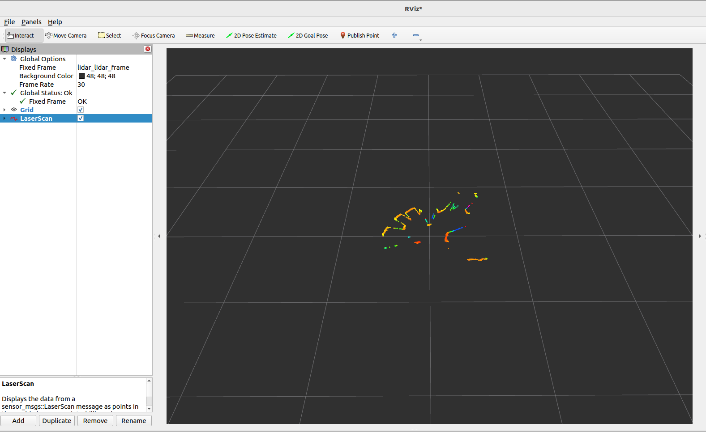

此 ROS1 驱动程序支持您使用 Orbbec 单线/多线激光雷达。本文档提供安装说明、使用指南和其他重要信息，帮助您快速开始使用此驱动程序。

## 安装

### 先决条件

在使用 OrbbecSDK ROS1 激光雷达驱动程序之前，请确保您的系统上安装了以下依赖项：

- **ROS1**: 有效安装 ROS1（Melodic、Noetic 或其他受支持的发行版）。
  - 如果您需要帮助，请参阅 [ROS1 安装指南](http://wiki.ros.org/ROS/Installation)。

### 安装依赖项

```bash
# 假设您已经配置了 ROS 环境
sudo apt install libgflags-dev nlohmann-json3-dev
```

### 安装 udev 规则

```bash
cd ~/catkin_ws/src/orbbec-ros-sdk/scripts
sudo bash install_udev_rules.sh
sudo udevadm control --reload-rules && sudo udevadm trigger
```

### 构建包

```bash
cd ~/catkin_ws/
# 构建发布版本，默认为调试版本
catkin_make -DCMAKE_BUILD_TYPE=Release
```

### 启动激光雷达节点

* 第一个终端

```bash
source devel/setup.bash
roslaunch orbbec_camera lidar.launch
```

* 第二个终端

```bash
source devel/setup.bash
rviz
```

1. 打开 RViz。
2. 添加 `PointCloud2` 或 `LaserScan` 显示。
3. 对于 `PointCloud2`，选择 `/lidar/cloud/points` 话题；对于 `LaserScan`，选择 `/lidar/scan/points` 话题。
4. 将 `Fixed Frame` 设置为 `lidar_lidar_frame` 以正确对齐数据。

* `PointCloud2` 可视化示例：


* `LaserScan` 可视化示例：



## 使用方法

### 运行驱动程序

要启动驱动程序，请启动提供的 ROS1 启动文件：

```bash
source devel/setup.bash
# 启动带有点云数据的驱动
roslaunch orbbec_camera lidar.launch lidar_format:=LIDAR_POINT
# 启动带有球面点云数据的驱动
roslaunch orbbec_camera lidar.launch lidar_format:=LIDAR_SPHERE_POINT
# 启动带有激光扫描数据的驱动
roslaunch orbbec_camera lidar.launch lidar_format:=LIDAR_SCAN
# 启动启用IMU的驱动
roslaunch orbbec_camera lidar.launch enable_imu:=true imu_rate:=50hz
# 启动同时包含点云和IMU数据的驱动
roslaunch orbbec_camera lidar.launch lidar_format:=LIDAR_POINT enable_imu:=true imu_rate:=100hz
```

此命令将启动与奥比中光激光雷达设备接口的节点。请确保在运行此命令之前正确连接激光雷达硬件。

### 获取已连接设备信息

```bash
rosrun orbbec_camera list_devices_node
```

此命令将列出已连接的激光雷达设备并显示其各自的IP地址和端口。您可以使用此信息配置驱动以连接到特定设备。

### 检查支持的配置

```bash
rosrun orbbec_camera list_camera_profile_mode_node
```

### 参数和配置

`lidar.launch` 文件包含驱动的默认参数。您可以通过修改启动文件或创建自定义配置文件来自定义这些设置。关键参数包括：

- **device_type**: 要启动的设备类型。可选值：`lidar`、`camera`。将此参数设置为 `lidar` 启动激光雷达设备，设置为 `camera` 启动摄像头设备。
- **camera_name**: 启动节点命名空间。
- **device_num**: 设备数量。如果需要启动多个设备，则必须填写此项。
- **upgrade_firmware**: 固件升级功能。输入参数是固件路径。
- **connection_delay**: 重新打开设备的延迟时间（毫秒）。在热插拔期间立即重新打开设备可能导致固件崩溃。
- **publish_tf**: 启用TF发布。
- **tf_publish_rate**: TF发布频率。
- **lidar_format**: 激光雷达的数据格式。可选值：`LIDAR_POINT`、`LIDAR_SPHERE_POINT`、`LIDAR_SCAN`
- **lidar_rate**: 激光雷达的扫描频率。
- **publish_n_pkts**: 发布合并数据前累积的帧数量。范围：1-12000。仅在激光雷达格式为 `LIDAR_POINT` 或 `LIDAR_SPHERE_POINT` 时有效，用于累积指定数量的帧后再发布合并的点云数据。默认值：`1`
- **enable_scan_to_point**: 启用扫描数据到点云数据的转换，发布PointCloud2数据类型话题。
- **repetitive_scan_mode**: 重复扫描模式参数。
- **filter_level**: 过滤级别参数。
- **vertical_fov**: 垂直角度参数。
- **min_angle**: 激光雷达扫描范围的最小角度（度）（例如，`-135.0`）。默认值：`-135.0`
- **max_angle**: 激光雷达扫描范围的最大角度（度）（例如，`135.0`）。默认值：`135.0`
- **min_range**: 激光雷达可测量的最小距离（米）。默认值：`0.05`
- **max_range**: 激光雷达可测量的最大距离（米）。默认值：`30.0`
- **echo_mode**: 激光雷达的回波模式。可选值：`Last Echo`、`First Echo`
- **enumerate_net_device**: 启用网络设备的自动枚举。
- **ip_address**: 网络设备的 IP 地址。
- **port**: 网络设备的端口号。
- **log_level**: SDK日志级别，默认值为 `none`，可选值为 `debug`、`info`、`warn`、`error`、`fatal`
- **time_domain**: 设备的时间戳类型。可选值为 `device`、`global`、`system`
- **enable_heartbeat**: 启用心跳功能，默认为 `false`。如果设置为 `true`，相机节点将向固件发送心跳信号；如果需要硬件日志记录，也应将其设置为 `true`。
- **enable_imu**: 启用IMU（加速度计+陀螺仪）并输出统一的IMU话题数据。
- **imu_rate**: IMU的统一频率（加速度计和陀螺仪）。
- **accel_range**: 加速度计的量程。
- **gyro_range**: 陀螺仪的量程。
- **linear_accel_cov**: 线性加速度协方差值，默认为 `0.0001`。
- **angular_vel_cov**: 角速度协方差值，默认为 `0.0001`。

## 点云数据详细说明

### 点云格式

PointCloud2 (PointXYZITO) 点云格式如下：

```
float32 x               # X轴，单位：米
float32 y               # Y轴，单位：米
float32 z               # Z轴，单位：米
uint8   intensity       # 激光雷达强度
uint8   tag             # 激光雷达标签
uint32  offset_time     # 点云相对话题时间的偏移量，单位纳秒
```

### 点云聚合功能

通过 `publish_n_pkts` 参数可以开启点云聚合功能，该功能允许激光雷达在发布数据前累积指定数量的帧，然后将这些帧合并为一个更大的点云数据包进行发布。

#### 功能特点：

- **参数范围**: 1-12000 帧
- **适用格式**: 仅在激光雷达格式为 `LIDAR_POINT` 或 `LIDAR_SPHERE_POINT` 时有效
- **默认值**: 1（即不聚合，每帧单独发布）
- **用途**: 提高点云密度，适用于需要更密集点云数据的应用场景

#### 使用示例：

```bash
# 聚合10帧数据后发布
roslaunch orbbec_camera lidar.launch lidar_format:=LIDAR_POINT publish_n_pkts:=10

# 聚合100帧数据后发布
roslaunch orbbec_camera lidar.launch lidar_format:=LIDAR_SPHERE_POINT publish_n_pkts:=100
```

**注意**: 增加 `publish_n_pkts` 值会提高点云密度，但同时会增加延迟和内存使用量，请根据实际应用需求进行调整。

## IMU数据

### IMU话题

启用IMU时，将发布以下话题：

- **`/lidar/imu/sample`**: 统一的IMU话题，包含 `sensor_msgs/Imu` 格式的同步加速度计和陀螺仪数据。
- **`/lidar/lidar_to_imu`**: 从激光雷达坐标系到IMU坐标系的变换关系。

### 使用IMU数据

要启用IMU数据采集：

```bash
# 启动并启用IMU
roslaunch orbbec_camera lidar.launch enable_imu:=true imu_rate:=50hz

# 检查IMU话题
rostopic list | grep imu

# 查看IMU数据
rostopic echo /lidar/imu/sample
```

IMU数据包括：

- **linear_acceleration**: 3D加速度数据（x、y、z），单位：m/s²
- **angular_velocity**: 3D角速度数据（x、y、z），单位：rad/s
- **orientation**: 四元数方向（硬件不提供，设置为零）
